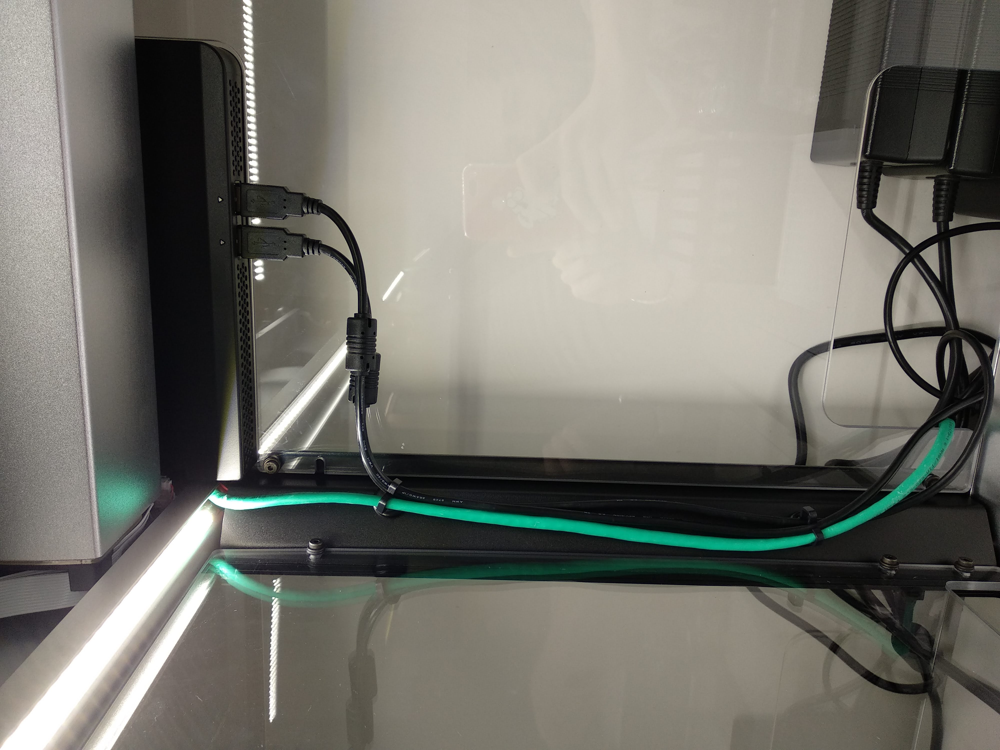

# OT-2 ethernet setup guide

## Steps

**WARNING:** once you disconnect the internal ethernet cable inside the robot, the USB port at the side of the panel will become useless. Please, make sure you have connected your robot to wifi before starting this process to make sure you have an alternative way to connect to the robot during the setup in case everything goes wrong.

1) Create the in the robot the file `/var/lib/NetworkManager/system-connections/eth0` with the following content:
```
[connection]
id=support-team-wired-static-ip
type=ethernet
autoconnect-priority=20
interface-name=eth0
permissions=
[ethernet]
cloned-mac-address=permanent
mac-address-blacklist=
[ipv4]
dns-search=
method=auto
```

This configuration will prepare your robots to get a dynamic IP address that must be set to fixed one by reserving it in your network DNS server. If you wanted to set a manual address, change the `[ipv4]` field as we did in the [wifi setup file](../../doc/S3/01_OT2_installation.md).

2) [Connect ethernet cable to the robot](https://support.opentrons.com/en/articles/3767128-connecting-to-your-ot-2-with-an-ethernet-cable)

3) The easiest way to tidy up the cable without drilling or cutting is by passing it through the left corner of the plastic cover, where there is already an aperture to pass the other cables. Then, take the cable down using the magnetic cable management hooks for the USB cables of the modules and take it out of the box through the bottom left hole of the rear panel.



4) Plug the cable and restart the robot. Now you should be able to find the robot in your wired network. Use the DNS manager to reserve a fix IP for the robot IPs.

**NOTE:** yes, IPs in plural. It has 2 IPs, one physical that has the hostname of the robot and a second virtual one called opentrons.

5) Try to connect your computer to the robot using its new IP address and with the opentrons' app. In case you connect with the robot on the browser but not in the app, try forcing the app to connect to the robot by adding the IP or hostname to the list of robots in More -> Manage. In case you can not connect on your browser, doublecheck you are in the same network and your firewall and connection permissions.
